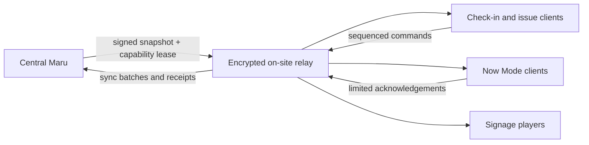

# Resilience and offline operation

Status: Baseline  
Last updated: 2026-07-26

A convention venue is a hostile network environment: overloaded Wi-Fi,
unreliable uplinks, power interruptions, captive portals, roaming devices, and
little time for diagnosis. Maru separates continuity of the event from
continuity of the central service.

## Safety premise

Maru is not an emergency-services radio, fire panel, medical device, or
substitute for trained command. Life-safety plans, contacts, assembly
information, and authority must have maintained offline and printed forms.

Software may support an emergency response, but a Maru outage cannot prevent
the response from beginning.

## Criticality tiers

| Tier | Examples | Outage behavior |
| --- | --- | --- |
| T0 Independent safety | emergency calls/radios, evacuation authority, essential medical procedure | designed and exercised outside Maru |
| T1 Live essential | credential verification, check-in/fulfilment, published schedule, staff assignment, critical contact/briefing, asset/key custody | focused offline or printed capability with later reconciliation |
| T2 Live important | service inbox, queue estimates, ordinary announcements, show notes, lost and found | cached read or paper fallback; queue safe writes where justified |
| T3 Planning | review, HR pipeline, budgeting, procurement, form design, large reports | clear maintenance state; resume centrally |
| T4 Convenience | optional analytics, recommendations, decorative dashboards | shed load first |

Every workflow declares a tier, maximum tolerated data age, offline authority,
fallback, reconciliation owner, and drill.

## Central service objectives

Initial engineering objectives, to be validated with a partner event:

- multi-zone production service where the selected provider permits;
- database point-in-time recovery with a recovery-point objective of five
  minutes or better;
- central service recovery-time objective of one hour for a regional component
  failure and a documented longer regional-disaster target;
- no acknowledged money, bid, credential, custody, or publication command lost
  after its transaction commits;
- status communication independent of the primary deployment; and
- capacity to run registration openings and live operation without sharing one
  unbounded worker queue.

Focused on-site continuity begins immediately and does not wait for the central
RTO.

## Maru Relay

Maru Relay is an optional, bounded on-site edge—not a second full Maru server.
It supplies selected T1/T2 functions over an edition-local network.

### Relay properties

- edition- and venue-scoped;
- encrypted storage and transport;
- registered device identity and short-lived signed capability lease;
- minimum dataset chosen by enabled function;
- append-only local command journal;
- monotonic per-device sequence and idempotency key;
- signed core snapshots with version, issue time, expiry, and hash;
- health, clock drift, data age, storage, and sync state displayed locally;
- remote revocation when connected and automatic expiry when not;
- no general Django administration, report builder, HR review, or C3 case file;
- rebuildable from central state after reconciliation.

Relay code and client packages must be distributable and exercised before
arrival; the venue is not the place to download a new runtime.

## Offline function matrix

| Function | Cached data | Permitted offline write | Conflict policy |
| --- | --- | --- | --- |
| Credential verify | token status, minimum display/entitlement, revocation snapshot | verification observation | later revocation is flagged, not retroactively hidden |
| Check-in | eligible roster and required fulfilment | check-in attempt, item issue, reprint request | duplicate check-in/issue enters explicit reconciliation |
| Badge/item issue | approved print payload, stock/serial allocation | custody event within leased stock range | server accepts unique issue or routes collision |
| Schedule | current and next signed releases | acknowledgement or local operational note | newer release supersedes; note retains source version |
| Staff assignment | narrow duty roster, contacts, briefings | accept, delayed, unavailable, complete | central reassignment wins prospective state; both facts retained |
| Asset/key custody | assigned subset and expected handovers | issue/transfer/return | impossible custody sequence requires owner review |
| Signage | approved playlist, assets, validity rules | local play telemetry; authorized local emergency card | expired ordinary content stops; emergency procedure is local and audited |
| Queue observation | location and safe capacity config | timestamped observation | observations append; estimates recalculate |
| Lost and found | minimal open inventory at this desk | intake and custody movement | merge likely duplicates manually |
| Payment | order balance reference only where needed | no offline card authorization; configured cash/manual promise record | reconcile provider/finance before settlement |
| Restricted safety case | duty contact and redacted active instruction only | acknowledgement/operational action where approved | full case update uses safety runbook or central service |

## Command reconciliation

Offline commands are never silently “last write wins.”

The core evaluates:

1. signature and device lease;
2. actor authentication available at time of action;
3. edition, function, and resource scope;
4. device sequence and idempotency;
5. snapshot and policy version used;
6. resource version and intervening central facts;
7. invariant and resulting side effects; and
8. required manual owner if no safe deterministic merge exists.

Results:

- **Applied:** accepted as the next valid fact.
- **Duplicate:** already applied; return the original receipt.
- **Superseded:** preserved as an observation but no longer changes current
  state.
- **Rejected:** invalid signature, scope, expiry, or impossible operation.
- **Review required:** competing valid facts require an accountable decision.

The operator sees both local receipt and final synchronization result.

## Graceful degradation

- Separate worker pools and quotas protect interactive T1 work from exports,
  bulk email, media, analytics, or planning.
- Circuit breakers and timeouts prevent a failed provider from exhausting
  requests or workers.
- Canonical writes do not wait synchronously for social, email, calendar, or
  document generation.
- Read-only mode is explicit and includes last-known data time.
- Expensive search, dashboards, image processing, and optional integrations can
  be disabled before core operations.
- Clients preserve unsent safe drafts and distinguish queued from accepted.
- Status pages and operator alerts name the affected capability, not merely
  “the system.”

## Backup and restore

Backups include:

- encrypted database base backups and transaction logs;
- versioned object storage or equivalent recovery;
- infrastructure and configuration required to restore;
- separately recoverable secrets and key procedure;
- schema, release, and dependency inventory; and
- deletion/restriction ledger to reapply after restore.

At least quarterly during active planning and before each live edition:

1. restore into an isolated environment;
2. validate manifest, schema, object references, and representative workflows;
3. replay deletion/restriction state as required;
4. compare key business invariants and counts;
5. record time, gaps, and operator evidence; and
6. destroy the test restore safely.

Backup success without restore evidence is not a readiness criterion.

## Venue readiness

Before doors open:

- named technical and operational owners;
- tested wired local network, addressing, power, and spare components;
- registered relay and clients with current snapshot;
- time synchronization and clock-drift alerts;
- preloaded badges, print assets, signage, schedule, staff briefings, and
  minimum lookup data;
- offline login or operator continuity strategy that does not share accounts;
- charged spare devices, printers, scanners, labels, and consumables;
- independent critical contacts and printed fallback packs;
- provider and central outage drills;
- reconciliation rehearsal using deliberate conflicting writes; and
- agreed thresholds for switching modes and returning online.

## Failure playbooks

Each dependency has a runbook covering detection, decision owner, user
communication, degraded state, recovery, reconciliation, and evidence.

Required scenarios include:

- central API unavailable;
- venue uplink unavailable;
- relay unavailable;
- database failover or restore;
- queue backlog;
- identity provider unavailable;
- payment provider delayed;
- email, push, or social delivery unavailable;
- object storage or malware scanner unavailable;
- schedule publication partially delivered;
- lost or compromised staff/relay device;
- printer or badge stock failure;
- power interruption;
- corrupted snapshot or clock drift; and
- emergency announcement channel disagreement.

## Observability during failure

Central and relay telemetry uses correlation, edition, capability, dependency,
result, latency, queue age, snapshot age, and sync-lag dimensions without
including attendee names or message content.

An operations log records:

- start and detection;
- declared impact and mode;
- decision roles;
- status updates;
- mitigations;
- recovery;
- reconciliation completion; and
- follow-up owner.

The public incident review separates system learning from restricted personal
or security detail.
