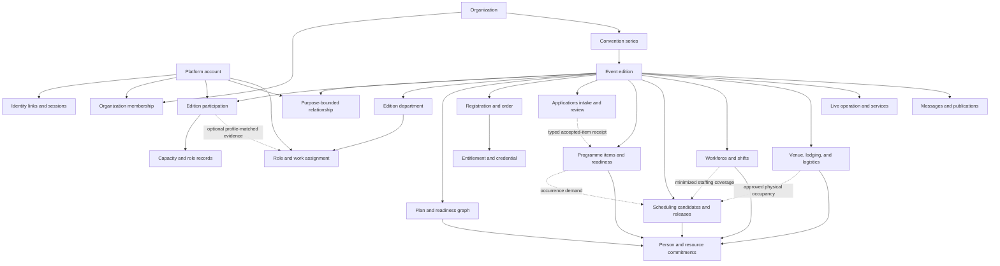

# Conceptual domain model

Status: Baseline plus dormant Programme foundation; composite runtime absent
Last updated: 2026-08-31

This model names stable concepts and ownership boundaries. It is not a promise
that every concept becomes one Django model or database table.

## Modeling rules

- A globally unique, opaque identifier is the durable identity of a record.
- Human-readable numbers and slugs are scoped aliases and may change.
- Tenant-owned records carry `organization_id`; edition records also carry
  `event_edition_id` directly, even when derivable through another relation.
- Aggregate state changes use commands that enforce invariants.
- Cross-module references use identifiers and public contracts, not foreign
  model imports in business code.
- Labels whose historical meaning matters are snapshotted at the transition
  that makes them historical.
- Status is a state machine with transition history, not a freely editable
  string.
- Money is an integer minor-unit amount plus ISO currency and tax context.
- Time uses an aware UTC instant for storage and the edition time zone for
  interpretation and display; date-only and local-wall-time concepts remain
  distinct.
- Files are immutable blobs with metadata and versioned relationships.
- Secrets, credentials, health data, identity documents, and ordinary profile
  fields are not generic JSON attributes.

## Structural map



## Root aggregates

### Platform account

Owns authentication-facing identity, locale, communication defaults, security
events, sessions, recovery methods, and account-level privacy actions.

It does not own an organizer's application answers, HR files, conduct records,
orders, or event roles. Account merging and splitting are explicit, audited
workflows because a mistaken merge is a cross-tenant disclosure risk.

### Organization

The tenant and governance root. It owns series, membership, organization-wide
roles, controlled vocabulary, integration installations, policy defaults, and
organization retention configuration.

An organization is not automatically entitled to every field on a platform
account. Membership is an organizer-owned relationship with its own state and
history.

### Convention series

The recurring brand and continuity root. It owns stable public identity,
edition templates, reusable knowledge, approved role templates, and
cross-edition reporting definitions. It does not own mutable live-edition
records.

### Event edition

The primary operational boundary. It owns authoritative time zone, dates,
locale, lifecycle, venue relationships, edition departments, configuration
versions, and links to all edition-scoped aggregates.

Lifecycle:

```text
draft -> preparing -> ready -> live -> closing -> archived
          ^           |
          +-----------+  (controlled return before live)
```

Cancellation is a reasoned terminal path with closeout obligations, not
deletion.

### Participation

An optional relationship between one platform account and one edition when the
immutable adoption profile deliberately adopts the Participation module. It is
not the universal anchor for every convention purpose. Applications,
Programme, and Workforce may own exact applicant, host, reviewer, Assignment,
Availability, and Shift relationships for a purpose-bounded account without
creating attendee Participation.

When present, Participation can anchor attendee, dealer, guest, press,
supplier, or other configured capacity evidence, but it does not collapse
those domain records into one status. Account existence, sign-in, hosting,
reviewing, volunteering, or receiving work never infers Participation.

Participation owns:

- edition-local display and contact choices;
- aggregate engagement state needed for the person's home;
- capacity memberships and their effective periods;
- archive-visible contribution snapshots; and
- a link to organizer-owned identity verification where required.

## Planning and organization

### Department and position

A department is a responsibility boundary with leads, services, inboxes,
budget, readiness, and escalation. A position is a versioned role design with
outcomes, workload, qualifications, onboarding, system capabilities, and
handover expectations.

An assignment joins a person to a position for an effective period and scope.
When the immutable edition profile adopts Participation, approval also projects
the configured Participation evidence and retains its non-null capacity
pointer. Every bounded profile that excludes Participation keeps that pointer
null and creates or touches no Participation evidence. This includes both
`workforce_only@1` and the accepted, inactive `programme_operations@1`; database and
runtime policy derive the rule from the manifest rather than a hard-coded list
of profile names. An assignment never grants permissions merely by matching a
display label.

### Work graph

`Objective`, `Project`, `Milestone`, `WorkItem`, `Dependency`, `Risk`,
`Decision`, `ChangeRequest`, `ReadinessCriterion`, and `Evidence` form a
connected planning graph.

A readiness assessment points to criteria and current evidence. It may be
Ready, At risk, Blocked, Not assessed, or Accepted risk. Percent complete is a
projection, never primary evidence.

## People and workforce

### Application, proposal, and review

Applications owns the call or definition, private proposal or application,
pipeline state, schema-versioned answers, collaborative revisions,
conversation, review assignments, rubric results, conflicts, moderation,
decisions, and appeals. Review visibility is explicit per field and stage.

Acceptance produces one immutable typed target receipt. It does not directly
create or mutate a Programme item, Shift, role, Participation row, Venue
booking, schedule occurrence, or public page. The target module consumes that
receipt idempotently through its public adapter and keeps the private
Applications evidence behind its original boundary.

### Onboarding plan

An accepted position instantiates an onboarding plan from versioned templates.
Its items may reference acknowledgements, training, qualification, equipment,
meetings, profile completeness, and access provisioning.

### Qualification

A qualification has issuer, evidence class, validity, expiry, verification, and
permitted use. Sensitive evidence may be retained separately from the fact that
the person is qualified.

### Shift and attendance

A shift is scheduled demand for a position, place, time, capacity,
qualification, supervisor, and briefing. `ShiftCommitment` connects an exact
account and qualifying Workforce Assignment to demand. A Participation link is
optional profile-matched evidence, not a precondition. Check-in, lateness,
absence, actual work, correction or dispute, handover, completion, and
recognition are separate facts.

## Registration and commerce

### Registration

A registration is the edition admission process for a participation. It owns
state, exact form submission versions, eligibility decisions, agreements,
attendee-visible timeline, and links to orders and entitlements.

`AttendeeRegistrationProfile` is a separate edition-owned, versioned aggregate.
An earlier same-organization profile can supply an explicit suggestion, but a
new registration creates an independent snapshot and current-profile changes
do not rewrite the immutable `RegistrationSubmission`. It owns restricted
contact data, structured pronouns/languages, public-list consent, and optional
moderated profile media. `AttendeeFursuit` is a scoped, retained child
collection with independent image review; removing one deactivates it rather
than erasing historical evidence.

### Catalog, order, and payment

`Product` and `ProductVariant` describe an offer. `Quota` controls scarce
availability. `PriceRule` and `EligibilityRule` are versioned inputs to a
decision.

An order owns immutable line snapshots, totals, reservation expiry, and state.
Payments, refunds, disputes, provider notifications, and allocations are
append-oriented ledger entries. Provider card data is never part of the
aggregate.

### Entitlement and credential

An entitlement is what a person may receive or do. A credential is a revocable
physical or digital representation. Issuance and fulfilment are custody events,
not booleans edited on the registration.

## Programme and temporal planning

### Programme item and readiness

A private proposal and its review remain Applications-owned. An accepted typed
receipt may create exactly one Programme item; organizer-created ceremonies,
breaks, announcements, and core events use a separate reasoned Programme
command and never invent a proposal or submitter.

A Programme item owns approved title, description, classifications, exact host
and co-host purpose relationships, content boundaries, access information,
capacity intent, production requirements, readiness criteria, and approved
public renditions. Host readiness, technical/accessibility delivery, Venue
operations, staffing, and Department discussion retain separate field
ceilings, owners, history, and visibility. Private Applications review evidence
is not one of these layers.

### Scheduling candidates and commitment graph

Scheduling owns occurrence identity and public timing. `ScheduleItem` is a time
demand; `Commitment` connects it through documented adapters to people, rooms,
spaces, equipment, vehicles, dependencies, preparation, effective delivery,
and teardown.

A `ScheduleCandidate` owns explicit placements, source versions, constraint
evaluations, warning overrides, and comparison evidence. Venues owns physical
availability, capacity, occupancy, and approval; Workforce owns staffing
demand and commitments. Scheduling reads those minimized results and does not
write either module's tables. A Programme-linked Venue record cannot publish a
second public timetable.

A `ScheduleRelease` is an immutable approved snapshot with artifact manifest,
supersession, and change impact. Personal discovery may use an exact Programme
host relationship or the person's retained Shift commitment and never requires
Participation. On-site version 1 projects released timing plus confirmed or
locked work; check-in, lateness, absence, Shift actual time, correction or dispute,
and Shift handover remain outside it under issue #24.

Wall-clock recurrence is avoided in operational records. Each occurrence has
explicit instants so daylight-saving changes cannot reinterpret history.

### Programme Operations adoption profile

The accepted, inactive `programme_operations@1` manifest pins shared
foundations `audit`, `authorization`, `effects`, `events`, `identity`,
`organizations`, and `privacy`, and adopted products `applications`,
`programme`, `scheduling`, `venues`, and `workforce`. It deliberately adopts
the complete current Workforce journey and excludes `accreditation`,
`catalog`, `charities`, `communications`, `logistics`, `participation`, and
`registration`. It does not adopt a general `operations` namespace.

Recovery and export are required, pinned continuity behaviors rather than
permission to enable an entire present or future module namespace.

Programme now has a dormant installed namespace, nine exact-edition capability
declarations, private item/readiness records, protected commands and queries,
and database integrity checks. Issue #61 does not add hosts, accepted-item
ingestion, a caller, route, destination, writer grant, effect route, or current
profile membership. Scheduling remains a contract namespace only, and the
`programme_operations@1` profile code and all composite surfaces remain
unavailable until successor runtime work implements and validates every
manifest member. A later capability cannot silently change the meaning of
version 1.

## Venue, lodging, logistics, and production

### Place

`Site`, `Building`, `Space`, `Zone`, `AccessRoute`, and `Entrance` form a
versioned place graph. Capabilities, capacities, barriers, service hours, and
map references belong to the relevant place version.

### Accommodation

`Property`, `RoomType`, `NightInventory`, `StayRequest`, `RoomGroup`,
`AllocationRound`, and `StayAssignment` distinguish attendee desire, scarce
inventory, policy decision, and provider confirmation.

### Asset and stock

An asset is serialized; a stock item is fungible. Both use append-only
movement and adjustment records. Custody, location, reservation, condition,
kit composition, and edition allocation are projections of those records.

### Technical production

`TechnicalAdvance`, `RiderRequirement`, `RoomConfiguration`, `CueSheet`,
`Cue`, `Rehearsal`, `Call`, and `ShowReport` attach production work to programme
items and schedule commitments.

## Communication and knowledge

### Conversation

A conversation has purpose, scope, participants or team inbox, sensitivity,
state, assignment, service target, and messages. Internal notes are a distinct
message visibility class, not a textual convention.

Messages are immutable after a short correction policy; redaction creates a
visible tombstone and controlled retained evidence where required.

### Announcement and publication

An announcement owns canonical content, audience definition, urgency,
translations, validity, approval, and correction relationship. A publication
version freezes rendered channel variants. Delivery attempts form a retryable
append-only history.

### Knowledge item and form

A knowledge item owns audience, owner, approved version, review date, and
supersession. A form schema owns typed classified questions; a submission
records the exact schema and routes into a typed domain workflow.

## Safety and restricted work

There is no universal `Incident` aggregate with universal access.

Medical, safeguarding, security, conduct, welfare, and accessibility concerns
use separate case types behind a common minimal routing contract:

```text
case reference + category + urgency + duty queue + acknowledgement state
```

Only the owning safety module resolves the restricted detail. It may issue a
redacted `OperationalInstruction` to another module. Evidence items have
separate custody, integrity, access, and retention.

## Physical-item and commercial specialties

Dealer applications, art or auction lots, charity campaigns, merchandise,
lost-and-found items, badges, keys, radios, and other custody-sensitive objects
share identifiers and movement primitives but retain domain-specific state
machines and permissions.

An auction bid is immutable. Corrections append a reasoned invalidation or
replacement; they do not edit a prior bid.

## Shared control records

These are platform infrastructure, not a generic business-domain dumping
ground:

- `CapabilityGrant` and `RoleAssignment`;
- `DomainEvent` and transactional `OutboxMessage`;
- `AuditEvent` and integrity checkpoint;
- `FileObject`, malware-scan result, and typed attachment;
- `IdempotencyRecord`;
- `ImportRun`, staged row, and provenance;
- `ExportJob` and expiring artifact;
- `AutomationDefinition` and `AutomationRun`;
- `ConnectorInstallation`, credential reference, and delivery attempt; and
- `ArchiveManifest` and reasoned amendment.

## Reference rules

| Relationship | Rule |
| --- | --- |
| Cross module | Store opaque identifier; validate through contract |
| Same aggregate | Database foreign key and invariant are appropriate |
| Person display | Resolve current permitted view; snapshot historical label |
| Historical edition | Reference immutable edition object or snapshot |
| External system | Store provider, remote opaque ID, sync state, not URL alone |
| File | Immutable object plus classified typed attachment |
| Money movement | Append entry and correction; never overwrite settled fact |
| Published content | Immutable release with superseding release |

## Deletion and anonymization

Deleting an account does not blindly cascade through organizer history.
Each aggregate has one of four outcomes under its policy:

1. delete because its purpose ended;
2. detach or pseudonymize the account link while retaining an operational fact;
3. retain a minimized statutory or safety record under explicit authority; or
4. retain a user-visible contribution chosen by the user.

The result must not leave broken financial, capacity, safety, or archive
invariants, and must be explainable to the data subject.
