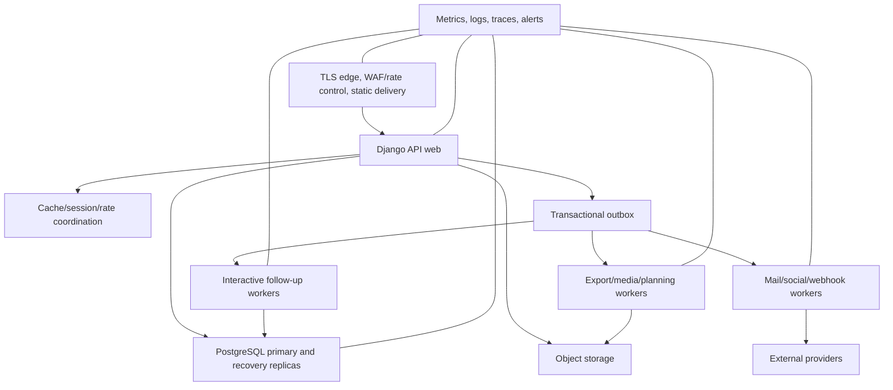

# Deployment and service objectives

Status: Registration safety services defined; target deployment certification required  
Last updated: 2026-08-31

Maru must be operable by a small professional team and approachable to
community contributors. It should not require a distributed-systems department
before the product serves its first convention.

## Supported deployment profiles

### Managed multi-organization

The default production profile runs one release serving multiple isolated
organizations. This enables one account, shared platform improvement, central
operations, and lower per-event cost.

### Dedicated deployment

A dedicated deployment may be offered for contractual, residency, scale, or
risk reasons. It uses the same release artifact, module contracts, migration
path, and operational controls. It is not a customer-specific fork.

### Development and rehearsal

Local development and CI use replaceable dependencies and synthetic fixtures.
A rehearsal environment can clone approved configuration and synthetic
production-shaped data, never unrestricted production personal data.
The maintained
[synthetic OCI runtime rehearsal](synthetic-oci-runtime-rehearsal.md) is the
bounded public evaluator path for the immutable candidate, PostgreSQL 17,
separate migration/runtime identities, exact authority activation, readiness,
and ordinary restart. It uses local synthetic settings in an internal network
and is not a supported production topology.
The companion
[synthetic OCI static delivery rehearsal](synthetic-oci-static-delivery-rehearsal.md)
serves the candidate's already-collected bytes from a read-only volume through
a reviewed digest-pinned unprivileged reference edge and proxies dynamic
requests to Gunicorn. It is a bounded evaluator composition, not a selection of
the production edge, TLS/WAF owner, provider, cache architecture, or settings.

Federation between independent Maru deployments is not an initial feature.
Portable export and later standards-based federation are preferable to hidden
database coupling.

## Logical components



The actual hosting provider and queue/cache products remain replaceable.
Kubernetes is not required; use it only if operating capability and scale
justify it.

The static-delivery evaluator models only the diagram's static/dynamic split on
a host-loopback endpoint. Its reference edge does not provide or certify the
diagram's production TLS, WAF, public rate-control, availability, or telemetry
responsibilities.

## Environment boundaries

- Local, CI, development, staging/rehearsal, and production use separate
  credentials and data.
- Production access is named, MFA-protected, time-limited where possible, and
  audited.
- A deployment has one immutable build identity and documented configuration
  fingerprint.
- Secrets come from a managed secret boundary and never source control,
  container images, client bundles, crash reports, or ordinary settings pages.
- Provider sandbox credentials cannot send to production audiences.
- The built-in `DEMO_PAYMENT_ADAPTER_ENABLED` setting is false in base and
  production settings and true only in local/test settings. Production uses an
  organization-scoped hosted-provider account, HTTPS allowlist, credentials
  and webhook secret from the secret manager, authenticated callbacks, and
  deployment review. The demo endpoint must never be enabled as a substitute.
- Public registration requires verified email by default. Identity and
  credential test-token exposure, missing privileged step-up, and closure-gate
  bypass are rejected by production configuration.
- Production notification destinations have test-safe allowlisting and
  rehearsal suppression.
- Infrastructure configuration and policy are reviewed code.

### Registration lifecycle schedule

While an edition has account verification, open registration, payment
reservations, wait-list entries, notifications, or provider effects,
deployment must supervise:

```text
python src/manage.py identity_delivery
python src/manage.py registration_lifecycle
python src/manage.py effects_worker --pool interactive
python src/manage.py effects_worker --pool delivery
```

Run lifecycle at least once per minute. It expires overdue reservations,
closes waitlists whose sale period ended, cancels open records owned by
inactive accounts, applies due restriction consequences, and promotes eligible
FIFO wait-list entries. Identity delivery sends durable verification/recovery
challenges. Effects workers project canonical messages, email, and other
registered work. Commands are repeatable, but not substitutes for a supervised
scheduler/process manager.

Operators must alert on missed runs, non-zero exit, growing candidate count,
oldest overdue reservation, payment/delivery/offline/privacy/restriction
queues, and outbox age/quarantine. `registration_lifecycle --dry-run` reports
would-change counts without changing state or offering a place. The detailed
procedure and fallback are in the [registration runbook](registration-runbook.md).

### Required production registration configuration

Production startup fails closed unless it receives:

```text
MARU_PUBLIC_BASE_URL
MARU_DEFAULT_FROM_EMAIL
MARU_EMAIL_HOST / PORT / HOST_USER / HOST_PASSWORD / USE_TLS / USE_SSL
MARU_CSRF_TRUSTED_ORIGINS
MARU_REGISTRATION_CLIENT_ORIGINS
MARU_PAYMENT_RETURN_ORIGINS
MARU_PAYMENT_PROVIDER_HOSTS
MARU_MEDIA_SCANNER=clamav
MARU_MEDIA_SCANNER_HOST
MARU_OFFLINE_MANIFEST_SECRET
MARU_IDENTITY_INVITATION_ENCRYPTION_KEY_ID
MARU_IDENTITY_INVITATION_PUBLIC_KEY_B64
MARU_IDENTITY_INVITATION_DIGEST_ACTIVE_KEY_ID
MARU_IDENTITY_INVITATION_DIGEST_KEYS_JSON
MARU_IDENTITY_INVITATION_RETENTION_POLICY_JSON
MARU_RUNTIME_DATABASE_ROLE
MARU_REQUIRE_EXACT_AUTHORITY_PROVENANCE=true|false
```

Along with the ordinary strong secret, explicit hosts, PostgreSQL URL, and
secure settings. Provider account rows name credential/webhook-secret
environment variables; their values are injected by the secret manager.

`MARU_PUBLIC_BASE_URL` is the bearer-link origin for account invitations. It
must be one already-normalized HTTPS origin: lowercase canonical host, optional
non-default port, and no userinfo, path, query, fragment, trailing slash, or
explicit `:443`. The invitation public encryption key is web-visible; its
private-key ring exists only in the delivery-worker environment. The dedicated
digest keyring contains one active 32–64 byte HMAC key plus at most three
fallback keys for controlled rotation. It must not reuse `MARU_SECRET_KEY`.

Invitation contact retention has no code-owned duration. Legal/controller
review must provide one exact closed JSON document in
`MARU_IDENTITY_INVITATION_RETENTION_POLICY_JSON`:

```text
{
  "policy_id": "replace-with-approved-policy-id",
  "version": APPROVED_POSITIVE_INTEGER,
  "jurisdiction_code": "REPLACE_WITH_APPROVED_JURISDICTION",
  "trigger": "terminal_transition",
  "period_days": APPROVED_NONNEGATIVE_INTEGER,
  "action": "anonymize_abandoned_invitation_contact",
  "approved_by_reference": "replace-with-review-reference",
  "approved_at": "REPLACE_WITH_APPROVED_UTC_TIMESTAMP"
}
```

The example values are not legal advice or production defaults. Replace every
value, including `period_days`, with the approved deployment policy. Unknown,
missing, overlong, naive/future-time, wrong-trigger, or wrong-action values
fail closed. After migration, run the following once with the migration-owner
database credential; the runtime role is deliberately SELECT-only on this
control:

```text
python src/manage.py activate_platform_invitation_retention_policy
```

Any policy change must advance `version`, receive a new approval reference and
time, and be reactivated before cleanup can resume. Policy timestamps and all
hold, receipt, assessment, heartbeat, and cursor evidence are compared with
the PostgreSQL clock without an application-host tolerance. Retention evidence
accepts only the exact source channels `operator` and `scheduler`.

Run invitation expiry, delivery, and retention as separate supervised jobs:

```text
python src/manage.py expire_platform_account_invitations --limit 1000
python src/manage.py platform_invitation_delivery --delivery-limit 1000
python src/manage.py run_platform_invitation_retention --limit 100
```

Expiry is key-independent and must continue when every delivery private key is
unavailable; it invalidates elapsed challenges and destroys their encrypted
payloads. The delivery job refuses startup unless its private ring matches the
active public key and covers every undestroyed delivery envelope. One missing
retired key is quarantined by direct batch processing and cannot starve later
healthy rows, but release readiness remains blocked until coverage is complete.
Alert on command failure and schedule both jobs frequently enough that the
oldest eligible row remains within the declared delivery and expiry objectives.
Each successful run appends a recipient-free heartbeat with only its worker
generation, database-materialized run time, processed count, remaining count,
and delivery-key coverage result. PostgreSQL rejects future or incoherent
heartbeat/cursor inserts. The production readiness contract currently
requires:

- a successful delivery heartbeat no more than 10 minutes old and no eligible
  delivery waiting more than 15 minutes;
- a successful expiry heartbeat no more than two hours old and no overdue
  pending invitation left for more than two hours;
- a matching `retention-v2` policy-digest heartbeat no more than 26 hours old,
  no unheld due cleanup backlog older than 24 hours, and no surviving C4
  envelope on a terminal invitation; and
- complete delivery private-key coverage before a delivery heartbeat may be
  recorded.

Schedule delivery at least every five minutes, expiry at least hourly, and
retention at least daily so a single missed run does not immediately exhaust
an objective. Retention processes at most 100 candidates per run; repeat a run
under supervision when `remaining` is non-zero. An active audited hold remains
in fair traversal, records `active_hold`, advances the cursor, and increments
`held`, but is excluded from actionable due backlog until an active platform
administrator records an audited release. Alert before the readiness ceiling,
not only after it fails. A command error records no success heartbeat; do not
synthesize one in a process supervisor.

Digest rotation is add-new, promote-new, retain-old, drain, then remove-old.
Before removing a fallback, the count-only readiness gate must prove that no
active invitation challenge names it. Identity migration `0013` deliberately
refuses an upgrade with any live pre-key-lineage invitation: revoke or expire
those invitations under the old release, verify that their ciphertext is
destroyed, and rerun the migration. Never force the recorder row or rewrite a
digest key identifier. Reversing the key-lineage migration after keyed traffic
is a forward-fix recovery event, not a routine rollback.

Identity migration `0017` refuses reversal when any invitation, hold, or
retention receipt exists. Corrective migration `0018` can reverse only while
there is no receipt, retention assessment, or `retention-v2` scheduler/cursor
evidence. It upgrades existing v7 receipts by tombstoning the complete provider
reference graph, including already pattern-shaped provider values, and adding
the matching disposed assessment. That assessment uses the immutable receipt's
historical policy digest; a later monotonic control activation does not rewrite
or invalidate already-applied disposal evidence. New non-disposed assessments
still require the active control digest. Once any v8
evidence exists, keep compatible code and fix forward or restore the complete
database and application to one reviewed pre-v8 point. Never fake an empty
recorder, disable guards, or clear evidence to force rollback.

Safe production defaults are:

```text
MARU_ALLOW_PROVISIONAL_PUBLIC_REGISTRATION=false
MARU_IDENTITY_EXPOSE_TEST_TOKENS=false
MARU_EXPOSE_TEST_CREDENTIAL_TOKENS=false
MARU_REQUIRE_PRIVILEGED_STEP_UP=true
MARU_ENFORCE_EDITION_CLOSURE_GATES=true
```

`MARU_REQUIRE_EXACT_AUTHORITY_PROVENANCE` has no implicit production value.
Declare `false` only while a deployment is intentionally before the ADR 0044
cutover. Declare `true` in the rehearsed cutover release and retain it after
activation so a partial restore or missing activation marker denies organizer
authority and keeps `/health/ready` unavailable instead of silently returning
to compatibility policy.
`MARU_RUNTIME_DATABASE_ROLE` is the dedicated PostgreSQL login-role name, not a
password. Production configuration rejects a missing, non-printable, or
overlength name. The migration-owner cutover report proves that named future
role has no privileged attributes, reserved/predefined identity, dangerous or
administratively delegable membership, no
database or non-system schema/relation/function ownership, no database
`CREATE`/`TEMPORARY`, no user-schema `CREATE`, and no table `TRIGGER`,
`TRUNCATE`, or `MAINTAIN`. It also denies effective parameter-control ACLs,
non-origin trigger settings, sequence `UPDATE`, and database/schema/relation/
column/sequence/function grant options. It must positively retain database
`CONNECT`, schema `USAGE`, four-operation DML on ordinary runtime relations,
`SELECT`/`INSERT` on Organization structure command receipts,
`SELECT`/`INSERT` on Workforce adoption setup receipts,
`SELECT`/`INSERT`/`UPDATE` on Organization structure controls,
`SELECT`/`INSERT` on Registration setup and account onboarding invitation transitions, receipts, delivery
attempts, late outcomes, reconciliation receipts, scheduler heartbeats, and
retention receipts, `SELECT`/`UPDATE` on its seeded inventory control,
`SELECT` on its owner-activated retention-policy control, and
`SELECT`/`INSERT`/`UPDATE` on identity challenges, invitations, deliveries, and
retention holds, sequence `USAGE`/`SELECT`, SELECT-only materialized-view and
activation-control reads with no table- or column-level `REFERENCES`,
and the exact versioned 21-function v3 policy/trigger-helper execute closure.
The installed but unactivated Programme relations are a stricter dormant
class: the runtime role has `SELECT` only on every `programme_*` table and no
Programme function execution. This permits integrity/readiness inspection but
cannot run the command core. A future profile-activation migration must review
and widen only the exact DML/function set required by its mounted writers.
Programme downgrade is exact only while its schema is empty. Migration `0003`
performs the early populated fence; the reverse paths of `0002` and `0001`
repeat same-transaction `ACCESS EXCLUSIVE` preflights immediately before guard
and table removal. A refusal preserves Programme tables, guards, and migration
evidence. Recover by fixing forward or by restoring Programme, Audit, Effects,
and migration history from one mutually consistent whole-database point.
The Applications-owned Programme-call/proposal relations use the same dormant
containment but remain distinct from ordinary mounted Applications tables. The
runtime role has `SELECT` only on every `applications_programme*` relation,
including the dedicated receipt, and no direct execution of their integrity
functions. Applications `0004` adds the schema, `0005` is the terminal
old-plus-new trigger/function catalog used by readiness, and `0006` refuses
populated downgrade. A later import or mounted workflow must review and widen
only its exact canonical writer; do not copy the generic Applications receipt
grants onto the dedicated Programme receipt.
The Workforce adoption and Organization structure receipts deny `UPDATE`,
`DELETE`, and `REFERENCES`; the structure control denies `DELETE` and
`REFERENCES`. Department remains on the ordinary DML
plane because its stopped-writer retirement trigger, not a table-wide ACL
revoke, enforces that lifecycle boundary.
Every Registration setup and account onboarding restricted relation denies `DELETE` and `REFERENCES`; its
additive ACL/catalog readiness is not evidence that the separate stopped-writer
generation has been activated.
`PUBLIC` may
execute no non-system function and the runtime role may execute no function
outside that closure. Adapt and rehearse
[`postgresql-runtime-role-provisioning.sql.example`](postgresql-runtime-role-provisioning.sql.example),
then inject the separate login credential through the secret manager. Only the
controlled migration/cutover owner activates the marker/latch. Runtime health
additionally proves that connected `CURRENT_USER`, `SESSION_USER`, and the
backend-authenticated identity are all the configured login and that live
`session_replication_role` remains `origin`; all failures remain one minimized
unavailable dependency. Release smoke uses a genuine fresh login rather than
owner role switching and never logs the credential.
The synthetic OCI rehearsal executes that genuine-login proof with the
reviewed role SQL, then recreates the exact-mode Gunicorn pool before accepting
readiness. Its count-only receipt supplements, but never replaces, production
secret-manager, infrastructure, recovery, and audit evidence.
Maru rejects caller-supplied PostgreSQL `options` in `MARU_DATABASE_URL` and
owns `search_path=public,pg_temp` for every connection. Restart every pool when
promoting this boundary. Health verifies the effective trusted schema order,
and compatibility-mode health rejects an already active or malformed cutover
database so a later `false` replica cannot silently appear ready.

Run `scripts/verify-production-settings.ps1` in release validation. It uses
verification-only values and runs `check --deploy` once for each explicit
pre-/post-cutover fence mode; it does not certify SMTP,
provider, scanner, storage, or offline devices.

## Release artifact

A repository release uses the CalVer and exact-source procedure in
[`release-process.md`](release-process.md). GitHub Container Registry holds the
primary application/worker image; a GitHub Release binds that digest to the
source and evidence. A release contains:

- immutable application and worker image references;
- source commit and build provenance;
- Python and frontend dependency locks;
- software bill of materials;
- database migration plan and compatibility window;
- OpenAPI, event, dataset, extension, and configuration schema versions;
- feature flags and default state;
- security and quality check results;
- operator notes and known limitations; and
- rollback or forward-fix procedure.

Build once, then promote the identical artifact. Environment configuration does
not rebuild application code.

The checked-in workflow publishes candidate ``vYYYY.MM.PR-rc.N`` and gold
``vYYYY.MM.PR`` identities only from an exact merged release pull request on
current `main`. It refuses existing Git, GitHub Release, or OCI names and never
overwrites a prior artifact. The release PR updates the Python project version
to the matching PEP 440 ``YYYY.M.PR`` form. Passing this repository workflow is
not production approval; all provider, infrastructure, load, accessibility,
restore/PITR, partner-policy, owner, and go/no-go gates below remain necessary.

The immutable application artifact must run `collectstatic` and include the
locked `drf-spectacular-sidecar` Swagger/ReDoc assets. Complete release smoke
must verify that an active platform administrator can load both private
references without third-party script, stylesheet, or font requests; the raw
schema must remain private, non-cacheable, and excluded from
registration-client CORS. The automated static-delivery stage proves the
authorized server HTML references, exact source sidecar inventory, and exact
served bytes except for one explicit ReDoc 2.5.3 compatibility representation.
That representation is derived at the edge from pinned source and output
hashes solely to replace the bundle's remote footer-logo URL with an inert
inline image; it does not alter the application image or collected volume. The
candidate acceptance record must add an authenticated browser-network check
for script-initiated requests before treating the no-third-party criterion as
met. The static-delivery rehearsal does not rerun `collectstatic`: it requires
the exact image directory and a freshly populated static volume to have
identical paths, file types, lengths, and SHA-256 digests before the read-only
edge serves them.

## Database evolution

Production migrations use expand/migrate/contract:

1. add backward-compatible schema;
2. deploy code able to use old and new forms;
3. backfill in bounded resumable jobs;
4. validate counts, invariants, tenant scope, and performance;
5. switch reads/writes with an observed flag or release;
6. retain compatibility through rollback window; and
7. remove obsolete schema in a later release.

Large table rewrites, blocking indexes, new non-null fields, enum/state changes,
and data transformations require representative-size rehearsal. A migration is
not rolled back if doing so would discard accepted user work; a forward repair
is prepared.

## Workload isolation

At minimum, capacity and concurrency are independently bounded for:

- API and authentication;
- live operational projections and notifications;
- payment and credential follow-up;
- ordinary mail, social, and webhooks;
- imports and exports;
- file scanning and media/document rendering;
- planning, solver, and analytics work; and
- maintenance and backfill.

Tenant fairness prevents one organization's export or campaign from starving
another event. Live editions can receive a declared priority profile without
silently dropping other tenants' committed work.

## Initial service objectives

These are engineering targets to validate and revise, not contractual service
levels.

| Indicator | Normal target | Declared live-event window target |
| --- | --- | --- |
| Core API successful availability | 99.9% monthly | 99.95% during window |
| Authorized common read server latency | p95 under 500 ms | p95 under 400 ms |
| Common command acknowledgement | p95 under 750 ms | p95 under 600 ms |
| T1 outbox start lag | 99% under 30 s | 99% under 10 s |
| Ordinary delivery start lag | 99% under 5 min | 99% under 2 min |
| Published schedule projection | 99% under 60 s | 99% under 20 s |
| Critical provider-state freshness | visible and under defined connector budget | visible and actively staffed |
| Database recovery point | 5 min or better | 5 min or better |
| Central component recovery time | 1 hour objective | immediate local fallback; 1 hour central objective |

Availability excludes correctly rejected unauthorized or invalid requests but
includes Maru-caused inability to complete a valid core operation. Provider
failure is reported separately and never hidden from the user-facing delivery
state.

## Event window

Each edition declares:

- sales or allocation peaks;
- build and arrival;
- doors-open through close;
- breakdown and critical reconciliation; and
- responsible technical and operational contacts.

Before a live window:

- changes require a higher review threshold;
- risky migrations and dependency upgrades freeze;
- tested feature flags define optional load shedding;
- on-call coverage, provider escalation, and status communication are active;
- relay and fallback checks pass;
- backups and restore evidence are current; and
- capacity headroom meets the event forecast.

Emergency change remains possible through an explicit, peer-reviewed procedure.

## Capacity model

Edition forecasts record:

- accounts, active registrations, orders, products, and concurrent sales;
- programme items, schedule commitments, rooms, releases, and calendar
  subscribers;
- staff, shifts, messages, announcements, and recipients;
- scanned credentials and offline commands per minute;
- form submissions, file count/size, reports, and export rows;
- screens and refresh cadence;
- integration events and provider limits; and
- retained editions and historical growth.

Load tests use realistic distribution, permission checks, search filters,
concurrency, retry, cache misses, and provider degradation. A simple endpoint
benchmark is insufficient.

## Scaling approach

1. measure and fix query plans, N+1 reads, serialization, caching, and payloads;
2. scale stateless web and worker instances horizontally;
3. isolate workload pools and add database read projections where safe;
4. partition append-heavy outbox/audit/activity data;
5. add specialized search or analytical stores through governed projections;
6. extract a module into a service only after ownership, scaling, or reliability
   evidence justifies the distributed cost.

Tenant sharding or service extraction requires an ADR and portable identifiers.

## Feature delivery

Feature flags have owner, purpose, environment/tenant scope, created date,
expiry/review, default, dependency, and removal task. Flags do not bypass
authorization or leave permanently untested combinations.

Changes roll through:

```text
local/CI -> development -> synthetic staging -> rehearsal edition
         -> selected partner -> general availability
```

High-risk changes use canary or selected-tenant rollout, observed success
criteria, and a stop condition.

## Cost controls

- budgets and alerts for compute, storage, logs, mail/SMS, maps, AI, document
  rendering, and other metered providers;
- per-tenant and per-operation quotas with an authorized increase path;
- retention and export expiry enforced;
- cardinality limits on telemetry labels;
- cost visible during campaign and load-test planning; and
- no automatic retry storm after provider recovery.

## Deployment readiness

A production deployment is ready when:

- threat and privacy reviews are current;
- infrastructure can be recreated from reviewed configuration;
- restore, failover, secret rotation, and provider-disable exercises pass;
- representative load and migration rehearsals pass;
- the selected hosted-payment adapter passes authenticated sandbox,
  refund/dispute/settlement, replay, mismatch, timeout, and disablement tests;
- registration lifecycle, identity delivery, effects workers, SMTP,
  scanner/storage, and offline devices have monitored owners and fallbacks;
- all five edition readiness gates have independent current evidence;
- monitoring and human response cover declared objectives;
- public status and internal escalation are independent of Maru;
- security updates have an owner and supported timeline; and
- the edition accepts documented residual risk and fallback.
