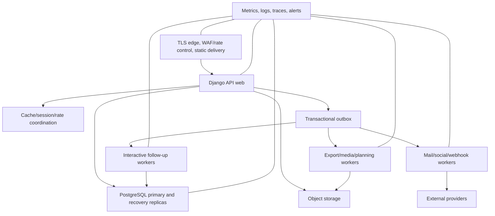

# Deployment and service objectives

Status: Registration safety services defined; target deployment certification required  
Last updated: 2026-07-28

Maru must be operable by a small professional team and approachable to
community contributors. It should not require a distributed-systems department
before the product serves its first convention.

## Supported deployment profiles

### Managed multi-organization

The default production profile runs one release serving multiple isolated
organizations. This enables one account, shared platform improvement, central
operations, and lower per-event cost.

### Dedicated deployment

A dedicated deployment may be offered for contractual, residency, scale, or
risk reasons. It uses the same release artifact, module contracts, migration
path, and operational controls. It is not a customer-specific fork.

### Development and rehearsal

Local development and CI use replaceable dependencies and synthetic fixtures.
A rehearsal environment can clone approved configuration and synthetic
production-shaped data, never unrestricted production personal data.

Federation between independent Maru deployments is not an initial feature.
Portable export and later standards-based federation are preferable to hidden
database coupling.

## Logical components



The actual hosting provider and queue/cache products remain replaceable.
Kubernetes is not required; use it only if operating capability and scale
justify it.

## Environment boundaries

- Local, CI, development, staging/rehearsal, and production use separate
  credentials and data.
- Production access is named, MFA-protected, time-limited where possible, and
  audited.
- A deployment has one immutable build identity and documented configuration
  fingerprint.
- Secrets come from a managed secret boundary and never source control,
  container images, client bundles, crash reports, or ordinary settings pages.
- Provider sandbox credentials cannot send to production audiences.
- The built-in `DEMO_PAYMENT_ADAPTER_ENABLED` setting is false in base and
  production settings and true only in local/test settings. Production uses an
  organization-scoped hosted-provider account, HTTPS allowlist, credentials
  and webhook secret from the secret manager, authenticated callbacks, and
  deployment review. The demo endpoint must never be enabled as a substitute.
- Public registration requires verified email by default. Identity and
  credential test-token exposure, missing privileged step-up, and closure-gate
  bypass are rejected by production configuration.
- Production notification destinations have test-safe allowlisting and
  rehearsal suppression.
- Infrastructure configuration and policy are reviewed code.

### Registration lifecycle schedule

While an edition has account verification, open registration, payment
reservations, wait-list entries, notifications, or provider effects,
deployment must supervise:

```text
python src/manage.py identity_delivery
python src/manage.py registration_lifecycle
python src/manage.py effects_worker --pool interactive
python src/manage.py effects_worker --pool delivery
```

Run lifecycle at least once per minute. It expires overdue reservations,
closes waitlists whose sale period ended, cancels open records owned by
inactive accounts, applies due restriction consequences, and promotes eligible
FIFO wait-list entries. Identity delivery sends durable verification/recovery
challenges. Effects workers project canonical messages, email, and other
registered work. Commands are repeatable, but not substitutes for a supervised
scheduler/process manager.

Operators must alert on missed runs, non-zero exit, growing candidate count,
oldest overdue reservation, payment/delivery/offline/privacy/restriction
queues, and outbox age/quarantine. `registration_lifecycle --dry-run` reports
would-change counts without changing state or offering a place. The detailed
procedure and fallback are in the [registration runbook](registration-runbook.md).

### Required production registration configuration

Production startup fails closed unless it receives:

```text
MARU_PUBLIC_BASE_URL
MARU_DEFAULT_FROM_EMAIL
MARU_EMAIL_HOST / PORT / HOST_USER / HOST_PASSWORD / USE_TLS / USE_SSL
MARU_CSRF_TRUSTED_ORIGINS
MARU_REGISTRATION_CLIENT_ORIGINS
MARU_PAYMENT_RETURN_ORIGINS
MARU_PAYMENT_PROVIDER_HOSTS
MARU_MEDIA_SCANNER=clamav
MARU_MEDIA_SCANNER_HOST
MARU_OFFLINE_MANIFEST_SECRET
MARU_RUNTIME_DATABASE_ROLE
MARU_REQUIRE_EXACT_AUTHORITY_PROVENANCE=true|false
```

Along with the ordinary strong secret, explicit hosts, PostgreSQL URL, and
secure settings. Provider account rows name credential/webhook-secret
environment variables; their values are injected by the secret manager.

Safe production defaults are:

```text
MARU_ALLOW_PROVISIONAL_PUBLIC_REGISTRATION=false
MARU_IDENTITY_EXPOSE_TEST_TOKENS=false
MARU_EXPOSE_TEST_CREDENTIAL_TOKENS=false
MARU_REQUIRE_PRIVILEGED_STEP_UP=true
MARU_ENFORCE_EDITION_CLOSURE_GATES=true
```

`MARU_REQUIRE_EXACT_AUTHORITY_PROVENANCE` has no implicit production value.
Declare `false` only while a deployment is intentionally before the ADR 0044
cutover. Declare `true` in the rehearsed cutover release and retain it after
activation so a partial restore or missing activation marker denies organizer
authority and keeps `/health/ready` unavailable instead of silently returning
to compatibility policy.
`MARU_RUNTIME_DATABASE_ROLE` is the dedicated PostgreSQL login-role name, not a
password. Production configuration rejects a missing, non-printable, or
overlength name. The migration-owner cutover report proves that named future
role has no privileged attributes, reserved/predefined identity, dangerous or
administratively delegable membership, no
database or non-system schema/relation/function ownership, no database
`CREATE`/`TEMPORARY`, no user-schema `CREATE`, and no table `TRIGGER`,
`TRUNCATE`, or `MAINTAIN`. It also denies effective parameter-control ACLs,
non-origin trigger settings, sequence `UPDATE`, and database/schema/relation/
column/sequence/function grant options. It must positively retain database
`CONNECT`, schema `USAGE`, ordinary runtime-relation DML, sequence
`USAGE`/`SELECT`, SELECT-only materialized-view and activation-control reads,
and the exact versioned 19-function v2 policy/trigger-helper execute closure.
`PUBLIC` may
execute no non-system function and the runtime role may execute no function
outside that closure. Adapt and rehearse
[`postgresql-runtime-role-provisioning.sql.example`](postgresql-runtime-role-provisioning.sql.example),
then inject the separate login credential through the secret manager. Only the
controlled migration/cutover owner activates the marker/latch. Runtime health
additionally proves that connected `CURRENT_USER`, `SESSION_USER`, and the
backend-authenticated identity are all the configured login and that live
`session_replication_role` remains `origin`; all failures remain one minimized
unavailable dependency. Release smoke uses a genuine fresh login rather than
owner role switching and never logs the credential.
Maru rejects caller-supplied PostgreSQL `options` in `MARU_DATABASE_URL` and
owns `search_path=public,pg_temp` for every connection. Restart every pool when
promoting this boundary. Health verifies the effective trusted schema order,
and compatibility-mode health rejects an already active or malformed cutover
database so a later `false` replica cannot silently appear ready.

Run `scripts/verify-production-settings.ps1` in release validation. It uses
verification-only values and runs `check --deploy` once for each explicit
pre-/post-cutover fence mode; it does not certify SMTP,
provider, scanner, storage, or offline devices.

## Release artifact

A release contains:

- immutable application and worker image references;
- source commit and build provenance;
- Python and frontend dependency locks;
- software bill of materials;
- database migration plan and compatibility window;
- OpenAPI, event, dataset, extension, and configuration schema versions;
- feature flags and default state;
- security and quality check results;
- operator notes and known limitations; and
- rollback or forward-fix procedure.

Build once, then promote the identical artifact. Environment configuration does
not rebuild application code.

## Database evolution

Production migrations use expand/migrate/contract:

1. add backward-compatible schema;
2. deploy code able to use old and new forms;
3. backfill in bounded resumable jobs;
4. validate counts, invariants, tenant scope, and performance;
5. switch reads/writes with an observed flag or release;
6. retain compatibility through rollback window; and
7. remove obsolete schema in a later release.

Large table rewrites, blocking indexes, new non-null fields, enum/state changes,
and data transformations require representative-size rehearsal. A migration is
not rolled back if doing so would discard accepted user work; a forward repair
is prepared.

## Workload isolation

At minimum, capacity and concurrency are independently bounded for:

- API and authentication;
- live operational projections and notifications;
- payment and credential follow-up;
- ordinary mail, social, and webhooks;
- imports and exports;
- file scanning and media/document rendering;
- planning, solver, and analytics work; and
- maintenance and backfill.

Tenant fairness prevents one organization's export or campaign from starving
another event. Live editions can receive a declared priority profile without
silently dropping other tenants' committed work.

## Initial service objectives

These are engineering targets to validate and revise, not contractual service
levels.

| Indicator | Normal target | Declared live-event window target |
| --- | --- | --- |
| Core API successful availability | 99.9% monthly | 99.95% during window |
| Authorized common read server latency | p95 under 500 ms | p95 under 400 ms |
| Common command acknowledgement | p95 under 750 ms | p95 under 600 ms |
| T1 outbox start lag | 99% under 30 s | 99% under 10 s |
| Ordinary delivery start lag | 99% under 5 min | 99% under 2 min |
| Published schedule projection | 99% under 60 s | 99% under 20 s |
| Critical provider-state freshness | visible and under defined connector budget | visible and actively staffed |
| Database recovery point | 5 min or better | 5 min or better |
| Central component recovery time | 1 hour objective | immediate local fallback; 1 hour central objective |

Availability excludes correctly rejected unauthorized or invalid requests but
includes Maru-caused inability to complete a valid core operation. Provider
failure is reported separately and never hidden from the user-facing delivery
state.

## Event window

Each edition declares:

- sales or allocation peaks;
- build and arrival;
- doors-open through close;
- breakdown and critical reconciliation; and
- responsible technical and operational contacts.

Before a live window:

- changes require a higher review threshold;
- risky migrations and dependency upgrades freeze;
- tested feature flags define optional load shedding;
- on-call coverage, provider escalation, and status communication are active;
- relay and fallback checks pass;
- backups and restore evidence are current; and
- capacity headroom meets the event forecast.

Emergency change remains possible through an explicit, peer-reviewed procedure.

## Capacity model

Edition forecasts record:

- accounts, active registrations, orders, products, and concurrent sales;
- programme items, schedule commitments, rooms, releases, and calendar
  subscribers;
- staff, shifts, messages, announcements, and recipients;
- scanned credentials and offline commands per minute;
- form submissions, file count/size, reports, and export rows;
- screens and refresh cadence;
- integration events and provider limits; and
- retained editions and historical growth.

Load tests use realistic distribution, permission checks, search filters,
concurrency, retry, cache misses, and provider degradation. A simple endpoint
benchmark is insufficient.

## Scaling approach

1. measure and fix query plans, N+1 reads, serialization, caching, and payloads;
2. scale stateless web and worker instances horizontally;
3. isolate workload pools and add database read projections where safe;
4. partition append-heavy outbox/audit/activity data;
5. add specialized search or analytical stores through governed projections;
6. extract a module into a service only after ownership, scaling, or reliability
   evidence justifies the distributed cost.

Tenant sharding or service extraction requires an ADR and portable identifiers.

## Feature delivery

Feature flags have owner, purpose, environment/tenant scope, created date,
expiry/review, default, dependency, and removal task. Flags do not bypass
authorization or leave permanently untested combinations.

Changes roll through:

```text
local/CI -> development -> synthetic staging -> rehearsal edition
         -> selected partner -> general availability
```

High-risk changes use canary or selected-tenant rollout, observed success
criteria, and a stop condition.

## Cost controls

- budgets and alerts for compute, storage, logs, mail/SMS, maps, AI, document
  rendering, and other metered providers;
- per-tenant and per-operation quotas with an authorized increase path;
- retention and export expiry enforced;
- cardinality limits on telemetry labels;
- cost visible during campaign and load-test planning; and
- no automatic retry storm after provider recovery.

## Deployment readiness

A production deployment is ready when:

- threat and privacy reviews are current;
- infrastructure can be recreated from reviewed configuration;
- restore, failover, secret rotation, and provider-disable exercises pass;
- representative load and migration rehearsals pass;
- the selected hosted-payment adapter passes authenticated sandbox,
  refund/dispute/settlement, replay, mismatch, timeout, and disablement tests;
- registration lifecycle, identity delivery, effects workers, SMTP,
  scanner/storage, and offline devices have monitored owners and fallbacks;
- all five edition readiness gates have independent current evidence;
- monitoring and human response cover declared objectives;
- public status and internal escalation are independent of Maru;
- security updates have an owner and supported timeline; and
- the edition accepts documented residual risk and fallback.
