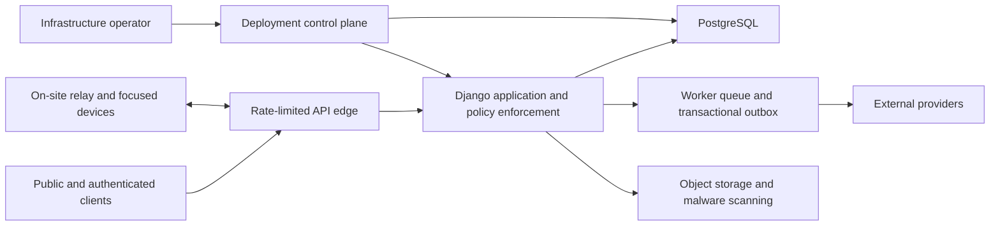

# Threat model

Status: Initial baseline  
Last updated: 2026-07-26

This living threat model covers the proposed architecture before code exists.
Every vertical slice must refine its assets, data flows, abuse cases, controls,
tests, telemetry, and residual risk.

The API analysis is informed by the
[OWASP API Security Top 10](https://owasp.org/API-Security/editions/2023/en/0x11-t10/),
especially object- and property-level authorization, sensitive business-flow
abuse, resource exhaustion, inventory, and unsafe third-party consumption.

## Security objectives

1. An organizer cannot access another organizer's records without an explicit
   subject-controlled or platform-governed exchange.
2. A staff member sees and changes only the resources and fields required for
   current responsibility.
3. Pseudonymous community identity is not linked to legal, hotel, medical,
   financial, or conduct information outside its narrow purpose.
4. Published event truth, money, bids, entitlements, credentials, schedule,
   access, audit, and archive cannot be silently rewritten.
5. Critical venue workflows remain safe, accountable, and reconcilable during
   outages.
6. No external connector can become an unbounded route into Maru or an
   irreversible source of truth.
7. Safety response remains possible when Maru is compromised or unavailable.

## Assets

- Account identities, authenticators, sessions, and recovery channels
- Organizer membership, capabilities, duty roles, and grants
- Pseudonym/legal-identity linkage
- Registration, hotel, travel, HR, accessibility, safety, minor, and case data
- Orders, refunds, budgets, bank/tax details, charity money, and auction bids
- Programme, schedule releases, emergency announcements, and signage
- Credentials, access zones, badge stock, keys, radios, assets, and custody
- Messages, decisions, contracts, files, and intellectual property
- Audit trail, archive manifests, backups, signing keys, and connector secrets
- Availability during sales openings and the live event

## Actors and adversaries

- Ordinary user who is curious, careless, coerced, or malicious
- Attendee attempting fraud, scalping, scraping, harassment, or unauthorized
  access
- Staff insider exceeding legitimate role, including former or compromised
  staff
- Organizer administrator making a dangerous configuration mistake
- External attacker using credential stuffing, phishing, injection, malware,
  denial of service, or supply-chain compromise
- Bot operator attacking scarce registration, lodging, dealer, or auction flows
- Compromised social, mail, payment, identity, file, or calendar provider
- Lost, stolen, shared, or tampered on-site device
- Abusive partner, stalker, or community actor seeking identity, hotel, or
  schedule information
- Infrastructure operator with exceptional technical access

## Trust boundaries

Every arrow is authenticated, authorized, encrypted where it crosses an
untrusted channel, bounded, observable, and assumed capable of failure.

## Priority threat register

| Threat | Example consequence | Required controls |
| --- | --- | --- |
| Tenant escape or broken object authorization | Convention A enumerates Convention B attendees | mandatory tenant keys, scoped query APIs, opaque IDs, negative matrix tests, cache/search isolation |
| Field overexposure or mass assignment | Front Desk receives HR notes; client changes staff status | explicit read/write schemas, classified field catalog, allowlists, property-level policy tests |
| Pseudonym correlation | legal name, hotel room, or case leaks to community peers | purpose partitions, separate projections, minimum disclosure, sensitive-read audit, no broad people export |
| Account takeover | attacker gets pass, messages, applications, or admin actions | modern external identity or hardened auth, passkeys/MFA for staff, session/device view, step-up, throttled recovery, anomaly signals |
| Staff privilege persistence | former volunteer retains next year's access | expiring edition grants, onboarding/offboarding reconciliation, access reviews, provider deprovision checks |
| Insider browsing and bulk export | staff searches celebrities or downloads attendee list | relationship policy, sensitive-read audit, query/export purpose, rate/volume anomaly, watermark, short artifact expiry |
| Bot abuse of scarce flows | ticket, hotel, dealer, or appointment inventory captured | queue/admission controls, transactional holds, per-flow limits, abuse detection, accessible challenge, fair allocation |
| Financial or webhook forgery | fake payment/refund or duplicate settlement | provider signature, replay window, idempotency, append ledger, separation of duties, reconciliation |
| Auction manipulation | bid changed or privileged late entry | trusted clock, append bids, close rule, immutable invalidation, monitoring, public/participant receipt where suitable |
| Schedule sabotage | room emptied or programme secretly changed | versioned drafts/releases, approval, impact preview, immutable publication, rapid rollback/supersession |
| Emergency-channel abuse | false evacuation post or signage takeover | narrow duty role, step-up, dual control where time permits, validity window, signed device content, immediate alert and review |
| Message spoofing or leakage | malicious “official” instruction; internal note sent to user | canonical sender/audience, clear message classes, authorization at render/delivery, immutable sent rendition |
| File attack | malware, active PDF, SVG/script, decompression bomb | type and size allowlist, quarantine, malware/CDR strategy, safe rendering, isolated metadata extraction, signed download |
| Spreadsheet formula injection | exported name executes when opened | neutralize formulas, explicit raw-data mode warning, tests for CSV/XLSX cells |
| Search/index leak | unauthorized result title or count appears | policy-scoped indexes or filters, projection testing, no shared cache without authorization dimension |
| Unsafe automation | rule mass-mails or grants access repeatedly | permission ceiling, dry run, action limits, idempotency, approval, versioned rollout, kill switch |
| Connector compromise | social token publishes abuse; provider payload injects data | secret vault, narrow scopes, verified endpoints, input validation, egress allowlist, disable/reconcile, no implicit trust |
| SSRF through webhooks/imports | attacker reaches internal metadata or control plane | destination verification, DNS/IP policy, egress proxy, redirect limits, network segmentation |
| Resource exhaustion/cost attack | export, email, PDF, search, or upload creates outage/bill | quotas, size/cardinality limits, async budgets, per-tenant fairness, provider spending alerts, backpressure |
| Offline replay or conflict | badge issued twice; revoked user checked in | signed expiring manifest, device sequence, idempotency, revocation snapshot, conflict state, human reconciliation |
| Lost on-site device | cached attendee or room data exposed | managed device, disk/app encryption, narrow dataset, short lease, remote revoke, screen lock, no C3 case detail |
| Audit tampering | privileged action disappears | append-only application API, restricted database role, hash-linked batches or external integrity checkpoints, monitored export |
| Backup or demo leak | old production database copied to laptop | encrypted isolated backups, controlled restore, synthetic non-production data, access and restore audit |
| Enumeration and stalking | person attendance, hotel, shift, or live location inferred | generic denial, privacy-preserving lookup, no presence API, rate limits, user block/report tools, staff training |
| Minor safety failure | guardian or pickup information exposed or bypassed | edition age policy, scoped verification, guardian workflows, restricted fields, safeguarding review and tests |
| Dependency/supply-chain compromise | package or build injects code | lockfiles with hashes where supported, minimal dependencies, review, SBOM, scanning, signed builds, isolated CI secrets |
| Admin misconfiguration | form exposes restricted answer or public report | secure defaults, classification required, preview with personas, policy lint, four-eyes approval for risky change |

## Security architecture controls

### Isolation

- Organization and edition scope are explicit columns and service inputs.
- Database uniqueness and reference constraints include tenant scope where
  needed.
- Cache keys, background jobs, file paths, search indexes, metrics labels, and
  webhook subscriptions preserve scope.
- Database row-level security may provide defense in depth after operational
  feasibility is proven; application authorization remains mandatory.

### Integrity

- High-value transitions use optimistic concurrency or row locking.
- Client retries use idempotency keys bound to principal, route, and request
  digest.
- Domain change and outbox publication commit atomically.
- Money, bids, custody, audit, and releases are append-oriented.
- Imports stage and preview before applying.

### Authentication

- Prefer phishing-resistant MFA/passkeys for privileged users.
- Recovery is at least as strong as sign-in and cannot expose account
  existence casually.
- Session inventory, revocation, step-up, credential rotation, and compromise
  response are product features.
- APIs validate issuer, audience, expiry, intended client, and token binding
  capabilities where available.

### Application and deployment

- Output encoding, CSRF protection for cookie sessions, CSP, secure cookies,
  origin controls, parameterized ORM use, and strict redirect/URL handling.
- Separate service and migration database roles; no application superuser.
- Secrets live outside code and logs and rotate without a deploy.
- Dependency, secret, static, dynamic, container, and infrastructure scanning
  feed release gates with human triage.
- Production debug mode is impossible by validated configuration.

## Abuse and community safety

Technical security includes abuse by otherwise authenticated people.

Maru must provide:

- block and communication-boundary behavior that does not reveal the blocker;
- reporting and staff escalation appropriate to the surface;
- no public attendee directory or live-location view by default;
- explicit public-history and discoverability choices;
- protection against mass invitations, messages, mentions, and scraping;
- high-friction bulk access to legal names, room allocation, or contact details;
- safe handling of deadnames and prior identifiers;
- clear official-message presentation resistant to social engineering; and
- organizer procedures for coercive requests and compromised staff accounts.

## Security verification gates

Before the first real event:

- independent threat-model review;
- automated tenant, object, property, function, and bulk authorization suite;
- authentication and recovery abuse testing;
- load and cost-abuse testing of sales, search, exports, files, and delivery;
- penetration test of public, staff, integration, and offline surfaces;
- restore and credential-compromise exercise;
- emergency publication and schedule integrity exercise;
- lost-device and offline reconciliation exercise;
- privacy and safety-case access review; and
- documented residual risks accepted by accountable organizers.

## Open risk decisions

- Identity provider and account recovery design
- Hosting and regional data boundary
- Encryption strategy for selected C3 fields and key custody
- Search engine and policy-scoped indexing model
- Offline relay device management and attestation
- Audit integrity checkpoint implementation
- Anti-bot approach that remains accessible and privacy-respecting
- Security monitoring provider and response coverage during live events
